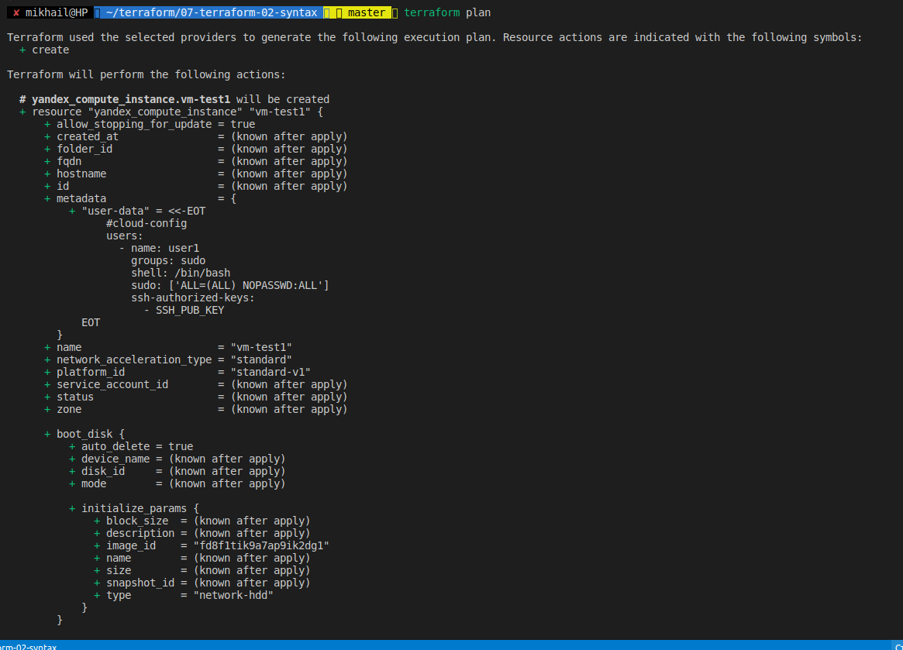

# 7.2. Облачные провайдеры и синтаксис Terraform

Задание очень сумбурное, но вот что у меня вышло. Прошу дать комментарии. Не понял как работать с переменными окружения. Я пытался их подготовить через [script.sh](script.sh), чтоб они автоматическии попали в определенные переменные, но он выдавал ошибку. Пришлось создавать файл private.auto.tfvars.   Данного файла в репозиторие Git не будет. Прошу поверить на слово. И так преступим.  Для начала я создал [main.tf](main.tf) там я определил переменные для токена и cloud id and folden id. Далее я вынес в отдельный файл .tf сеть и [instance-group.tf](instance-group.tf)(instans не понимаю этого слова в полной мери) групп, в которой обозначил создаваемый образ, размеры и кол-во ядер и диск для установки. Так же указал там, к какой сети мы подцепляемся. Там же я указал основные моменты для установки системы и откуда их брать. Прошу глянуть этот [момент](meta.yml), так как SSH-key.pub как закинуть на удаленный сервер я не понял и оставил как есть.  Далее я привиду небольшие команды, которые выполнил. 

    terraform init

    Initializing the backend...

    Initializing provider plugins...
    - Finding latest version of yandex-cloud/yandex...
    - Installing yandex-cloud/yandex v0.75.0...
    - Installed yandex-cloud/yandex v0.75.0 (unauthenticated)

    Terraform has created a lock file .terraform.lock.hcl to record the provider
    selections it made above. Include this file in your version control repository
    so that Terraform can guarantee to make the same selections by default when
    you run "terraform init" in the future.

    Terraform has been successfully initialized!

    You may now begin working with Terraform. Try running "terraform plan" to see
    any changes that are required for your infrastructure. All Terraform commands
    should now work.

    If you ever set or change modules or backend configuration for Terraform,
    rerun this command to reinitialize your working directory. If you forget, other
    commands will detect it and remind you to do so if necessary.

И далее 

    terraform plan

По идее всё. Прошу дать обратную связь по переменым, пытался сделать вот так

    provider "yandex" {
        token = "${YC_TOKEN}"
        cloud_id = "${YC_CLOUD_ID}"
        folder_id = "${YC_FOLDER_ID}
И по передаче SSH ключей на удаленный сервер.
